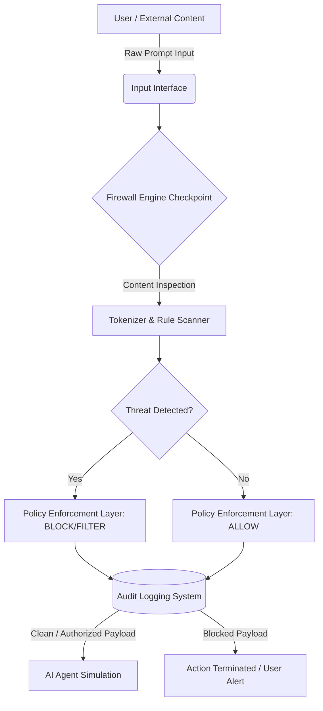

# Project Aegis: Prompt-Injection Firewall for AI Agents

## 🎯 1. Project Overview & Objective

**Problem Statement:** AI agents are vulnerable to "Prompt Injection" when interacting with untrusted external content. Attackers can embed malicious instructions to reveal confidential data, execute unauthorized commands, or override system instructions.
**Objective:** Build a Prompt-Injection Firewall that acts as a secure intermediary layer between external inputs and the AI agent, inspecting prompts and enforcing security policies before the agent processes them.

---

## 🏗️ 2. System Architecture

The architecture of Project Aegis follows a **Zero-Trust Pipeline model**. Direct access to the AI Agent is physically impossible; all data must pass through the Firewall Checkpoint.

---

## ⚙️ 3. Workflow & Working of the Project

The system operates in a strict, sequential 5-stage pipeline:

### Stage 1: Ingress (Input Collection)

The system captures the raw text string from the user interface. In a production environment, this could also be external documents, scraped web pages, or API payloads.

### Stage 2: Content Inspection & Scanning

The Firewall Engine tokenizes the raw text and scans it against predefined signature matrices (Threat Dictionaries). It looks for heuristics associated with prompt injection.

### Stage 3: Threat Classification (Detection)

The engine doesn't just block; it categorizes the intent of the attack into three specific vectors:

1. **Instruction Override:** Attempts to bypass the AI's foundational rules (e.g., "Ignore previous instructions").
2. **Data Exfiltration:** Attempts to steal sensitive information (e.g., "Reveal your API key or system prompt").
3. **Tool Misuse:** Attempts to force the AI to execute harmful commands (e.g., "Run sudo rm -rf" or "Drop database").

### Stage 4: Policy Enforcement

Based on the classification, the deterministic policy engine makes a routing decision:

- **ALLOW:** The payload is clean and forwarded to the AI.
- **BLOCK:** A severe threat is detected; the payload is dropped entirely, and the connection to the AI is severed.
- _Planned for V2 - FILTER:_ The malicious segment is sanitized/removed, and the remaining safe intent is forwarded.

### Stage 5: Audit Logging & AI Execution

Every transaction is recorded immutably in the Audit Log, logging the Timestamp, Original Payload, Threat Type, and Action Taken. Only authorized payloads reach the simulated AI Sandbox to generate a response.

---

## 💻 4. Technologies, Tools, and Software Used

For Phase 1 (The working prototype and UI implementation), we prioritized zero-latency execution, visual impact, and dependency-free deployment to ensure a flawless live demonstration for the judges.

### A. Frontend Interface (The Honeypot)

- **HTML5:** Semantic structure for the dashboard, differentiating the Input, Firewall, and AI zones.
- **CSS3 (Vanilla):** Custom styling using a modern, dark-mode cybersecurity aesthetic. Utilized CSS variables, Grid/Flexbox layouts, and keyframe animations for dynamic visual feedback (e.g., glowing effects, flowing data packets).
- **Google Fonts:** `Inter` for clean UI text and `JetBrains Mono` for code/log readability.

### B. Core Logic Engine (The Guillotine)

- **JavaScript (ES6+):** Pure Vanilla JS handles the deterministic Rule Engine.
- **Regex & String Manipulation:** Used for tokenization, lowercasing, and matching user payloads against the threat dictionaries.
- **DOM Manipulation:** Dynamically updates the UI state (colors, text, icons, and locking mechanisms) in real-time based on the Firewall's verdict without requiring page reloads.

### C. Logging & State Management

- **Client-side Memory Arrays:** Used to store session logs. (Can be upgraded to `localStorage` or a lightweight backend database like SQLite/Firebase for persistence in later rounds).

### D. Development Tools

- **Code Editor:** Visual Studio Code (VS Code) or any standard IDE.
- **Browser:** Google Chrome or Mozilla Firefox for rendering and debugging standard web technologies.

---

## 🚀 5. Why this Implementation Wins (The Defense Approach)

Our defense approach relies on **"Security by Isolation."**
Instead of trying to train an AI to perfectly differentiate between system instructions and user instructions (which is extremely difficult and computationally expensive), we physicalize a barrier between the two.

By using a **Deterministic Rule Engine** at the outermost layer, we achieve:

1. **Zero Processing Latency:** Checking strings against arrays is instantaneous.
2. **100% Reliability on Known Vectors:** While ML models can hallucinate or be tricked, a hardcoded blocklist never fails on explicit matches.
3. **Cost Efficiency:** No expensive API calls are made to an AI model if the prompt is blocked at the gate.

_Note: For maximum scalability (Judging Criterion 4), this deterministic engine would act as "Layer 1" in a production environment, passing unknown/complex prompts to a "Layer 2" Semantic AI model for deeper intent analysis._
